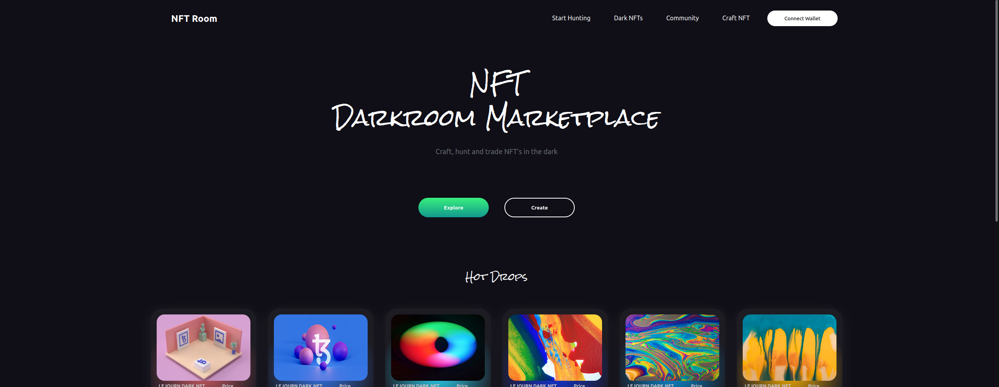

# Nft Marketplace
Reactjs And Smart Contracts Basic Nft Marketplace App

## 🖥️ Screenshoots 

### Home

### Explore

### Nft Detail

### Augmented Reality Support

## 🎉 Roadmap

 - [x] Base Components (9/9) (Base components of the project )
 - [ ] Search Filters for Explore Page
 - [x] Connect Wallet (ETH Wallets)(Supports Other Wallets 🚀)
 - [x] NFT Detail Page
 - [ ] Smartcontract Backend (Truffle)
 - [ ] Community Page
 - [x] Login
 - [ ] NFT Create Page
 - [ ] Users Pages
 - [ ] User Collections
 - [ ] Connect Wallet Popup
 - [ ] Supported Mobile Devices
 - [x] AR supports for 3d NFTs

## 🔮 Usage
In the project directory, you can run:

### `npm install (for first running)`
### `npm start`

## 🗞️ Docs
 - [Base Components](https://github.com/trueuni/nft-marketplace/blob/main/docs/design/BaseComponents.md)

<table>
  <tbody>
    <tr>
      <td align="center" valign="top" width="14.28%"><a href="https://github.com/GehadSalemFekry"> <b>Gehad Salem Fekry</b></a> <a href="#content-GehadSalemFekry" title="Content">🖋</a></td>
      <td align="center" valign="top" width="14.28%"><a href="https://github.com/digambar-t7"> <b>Digambar Tupurwadi</b></a> <a href="https://github.com/yessGlory17/nft-marketplace/issues?q=author%3Adigambar-t7" title="Bug reports">🐛</a></td>
      <td align="center" valign="top" width="14.28%"><a href="https://github.com/burakkaraceylan"> <b>burakkaraceylan</b></a> <a href="https://github.com/yessGlory17/nft-marketplace/commits?author=burakkaraceylan" title="Code">💻</a></td>
      <td align="center" valign="top" width="14.28%"><a href="https://bandism.net/"> <b>Ikko Ashimine</b></a> <a href="#content-eltociear" title="Content">🖋</a></td>
      <td align="center" valign="top" width="14.28%"><a href="https://github.com/Vansh-Baghel"> <b>Vansh Baghel</b></a> <a href="https://github.com/yessGlory17/nft-marketplace/commits?author=Vansh-Baghel" title="Code">💻</a></td>
    </tr>
  </tbody>
</table>

<!-- markdownlint-restore -->
<!-- prettier-ignore-end -->

